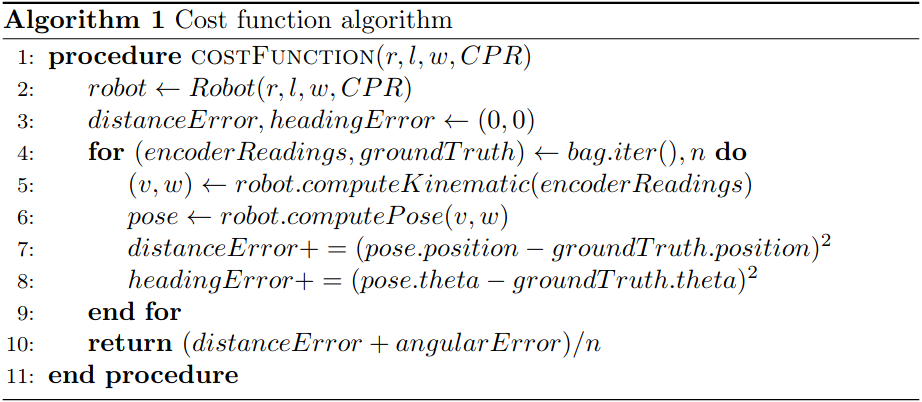
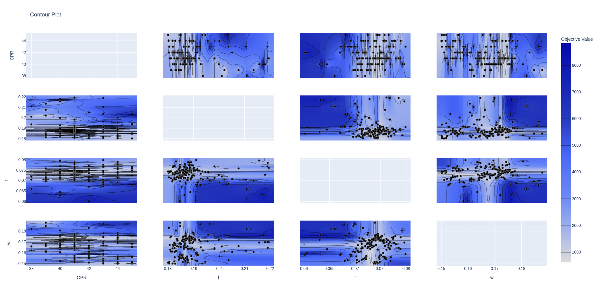
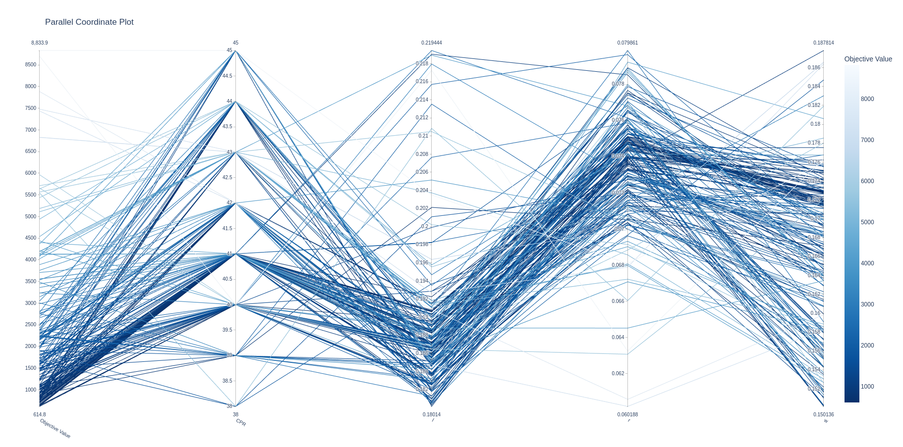
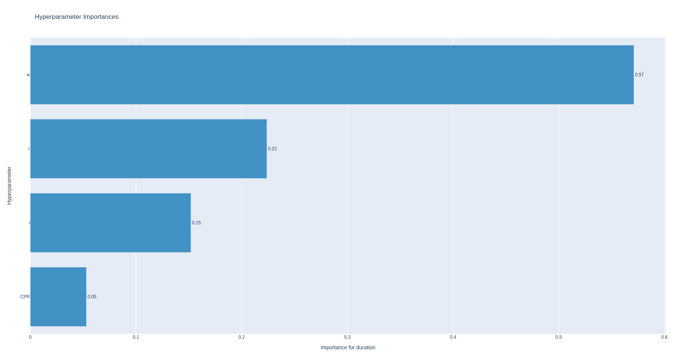
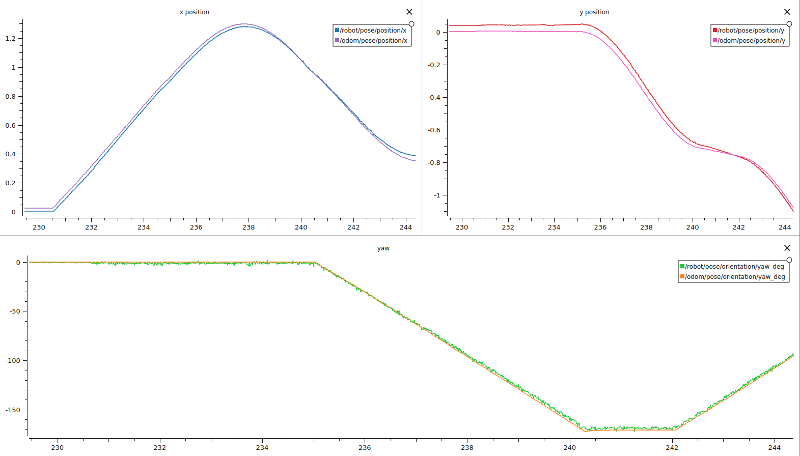
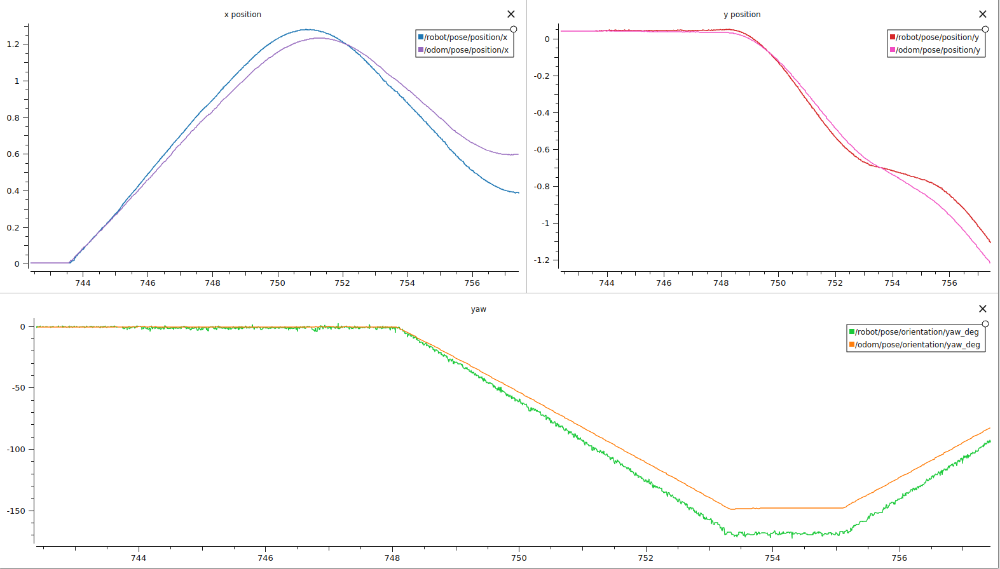

# Robotics: project1

## Student ID

Federico Sarrocco: 10696136

## Archive description

The archive contains:

- A **src** folder containing all .cpp files and a python script to perform one shot calibration.
- An **include** folder containing .h files
- A **msg** folder for custom messages
- A **srv** folder for custom services
- A **launch** folder for launch files
-  A **config** folder containg node parameters
- A **cfg** folder containing dynamic-reconfigure related file
- A **plotjuggler** folder containing used plotjuggler configuration
- An **images** folder containing the images collected during the project

In particular, this is the structure of **include** folder:
- **kinematic**
    - `Kinematic.h` an interface to build kinematic models
    - `MecanumKinematic.h` a concrete class containing the kinematic of a mecanum robot
    - `WheelEncoderHelper.h` classes and functions to handle encoder readings
- **odometry**
    - `Odometry.h` containing methods for update position given angular and linear speed
    - `Integrator.h` an interface for building different kind of integration algorithms
        - `Euler.h` a concrete class implementing Integrator.h
        - `RungeKutta4.h` a concrete class implementing Integrator.h
-  **filtering**
    - `Filter.h` an interface for building filters
    - `LowPassFilter.h` a concrete class implementing Filter.h

## Name and meaning of ROS parameters
All parameters are dynamically loaded from a configuration file, it's located in **config/default.yaml**.
I used the following parameters to set publisher and subscriber topics and to set the tf2 frame id names:

     ros:  
      subscriber_topic_wheel: "/wheel_states"  
      publisher_cmd_vel: "/cmd_vel"  
      publisher_wheels_vel: "/wheels_rpm"  
      publisher_odom: "/odom"  
      
      robot_frame_id: "base_link"  
      odom_frame_id: "odom"  
      global_frame_id: "world"

To set robot related parameters i used the following ones:

    robot:  
      params:  
    	  r: 0.072058 
    	  l: 0.19090  
    	  w: 0.166092 
    	  CPR: 40 
    	  gearRatio: 5  
    
      starting_odom: [0.000664, 0.02518, 0.004701]

- **robot/params** contains all physical robot parameters:
    - `r`: wheel radius
    - `l`: wheel position along x
    - `w`: wheel position along y
    - `CPR`: encoder resolution (counts per revolution)
    - `gearRatio`: gear ratio of the robot
- `starting_odom` initial odom pose. I decided to set the starting point as a parameter as usually does not exists a ground truth publisher, so from my point of view it makes not so much sense to make a subscriber to the ground truth.

## TF-TREE structure
Accordingly to the [REP-105](https://github.com/ros-infrastructure/rep/blob/master/rep-0105.rst) i used three frames:

- **base_link**: rigidly attached to the mobile robot base (ideally attached to the cog)
- **odom**: The coordinate frame called `odom` is a world-fixed frame. The pose of a robot in the `odom` frame is guaranteed to be continuous
- **world**: `world` is a world fixed frame, with its Z-axis pointing upwards.

The `world` frame is the parent of `odom`, and `odom` is the parent of `base_link`. Although intuition would say that both `world` and `odom` should be attached to `base_link`, this is not allowed because each frame can only have one parent.
So the tf tree is the following one:
**`world-->odom-->base_link`**

When the pose of the robot is externally changed with `setPose service` the frame `odom` is set the the new pose and the frame `base_link` is reset coincident with `odom`

## Structure of custom messages
The only custom message I used is the one required by the specifications. ( As I've just one node so no overhead due to multiple node communication)
The message is located in **msg/WheelsSpeed.msg** and has the following fields:

    Header header
    float64 rpm_fl
    float64 rpm_fr
    float64 rpm_rr
    float64 rpm_rl
## How to start/use nodes
As specified in the requirements I made just **one launch file**,  so to start the node you just have to build the node `catkin_make` or `catkin build`, source the environment `source devel/setup.bash` and the launch the node: `roslaunch task1 default.launch`.

The launch file is located in `launch/default.launch`. If you want to load a different **starting position** or change some parameters you can modify the configuration file in `config/defalut.yaml`. (There is a comment for the different starting positions of the different bags inside `defalut.yaml`)

You can use **dynamic reconfigure** launching: `rosrun rqt_reconfigure rqt_reconfigure` to change the *integration method* and to enable/disable a *low pass filter* on wheels speed.

You can set robot position using the **service set_pose**.

    rosservice call /task1_node/set_pose "x: 0.0
    y: 0.0
    theta: 0.0" 

### Calibration
The calibration is performed in python (easier to use for optimization tasks instead of c++), to perform a calibration you need to have a csv representation of the bag file and then run the script in `src/scripts/calibrator.py`. (If you do not have a .csv of the bag you can use the script `src/scripts/bagToCsv.py`)

# Low pass Filter
I noticed a lot of noise in the encoder reading, so I tried to filter it out. As, usually, for control algorithms is better to use noise free feedback variables.
I implemented a simple discrete low pass filter:

>_lowPass.svg)

>_params.svg)

I performed some comparison tests, I found no improvment on the overall odometry computation, but **an huge reduction 
in noise in (w,v) and (wheel speeds) variables.**

The following image shows the computed wheel speed for the front-right wheel, in the first half the filter was active, 
while in the second half no filtering was performed.

# Calibration overview
In order to perform an optimal calibration I implemented a software to do it automatically.
I developed a **cost function** in order to evaluate different parameter configurations  `(r, l, w, CPR)`.
The cost function is the sum of the mean-squared-error of the **distance** and the **heading**.

Given a configuration `(r, l, w, CPR)`  I firstly build a **kinematic model** of the robot, and then perform odometry for each step in the bag. For each step I compute the error in distance and heading between the **ground-truth**.

## Parameter optimization
I used Optuna (optimization framework) to find the best set of parameters.
I used the second bag to calibrate and the first and third to evaluate (the second contains both rotations and translations).
I tried 1200 possible configurations (the optimization algorithm firstly samples uniformly in the configuration space, then it samples more near low cost places).
I got the following results:

### Results overview

baseline configuration: `w = 0.169, l = 0.200, r = 0.07, CPR = 42`  
**best configuration found**: `w = 0.1660, l = 0.1909, r = 0.07205, CPR = 40`

| Configuration |bag | MSE |
|--|--|--|
| baseLine | bag2 (train)| 1.2861 |
| optimized | bag2 (train)| 0.7165 |
|||
| baseLine | bag1 (test)| 2.8958 |
| optimized | bag1 (test)| 0.85687 |
|||
| baseLine | bag1 (test)| 1.563079 |
| optimized | bag1 (test)| 0.9864 |

So after the train on bag2, we can observe consistent improvments both on bag and bag3

### Configuration space
In the image below you can see the correlation between the different parameters.
 You can clearly see that the minimum
cost for 
- `l` is between [0.18-0.195]
- `r` is between [0.065-0.079]
- on `w` it's not evident a unique minima, it's a lot correlated with the others params
- same for `CPR`, a small minima maybe around 40

#### Params parallel plot 
In this plot you can see the different tried configurations and their associated cost.

#### Params importance plot
In this plot you can see how each parameter is influent on the overall cost

## Plot of ground truth vs computed odometry

**calibrated parameters bag3 start**

**NO calibration bag3 start**

